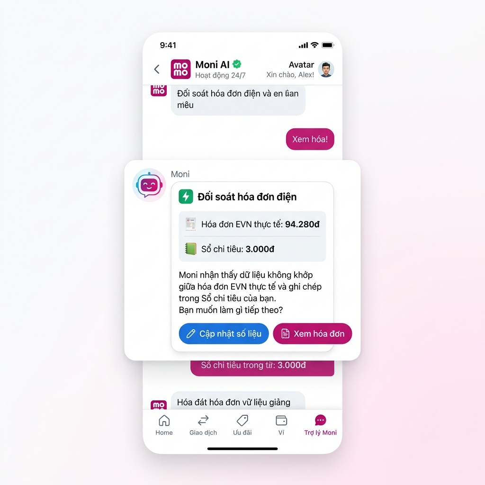

# Workshop — Mổ App AI Thật: Trợ thủ tài chính MoMo - Moni

**Thời gian:** 35-45 phút  
**Hình thức:** Cá nhân  
**Đề tài:** Phân tích điểm gãy UX của Trợ lý AI Moni trên MoMo & Đề xuất cải tiến  
**File báo cáo:** [app-teardown.md](file:///c:/Users/vando/OneDrive/Desktop/Day05-AI-Product-Labs_Batch_2/01-invidual-workshop/Day06-2A202600795-Nguyễn Văn Đoan/app-teardown.md)

---

## 1. Ứng dụng & Tính năng cấu trúc

- **Ứng dụng tuyển chọn:** MoMo
- **Tính năng AI khảo sát:** Trợ lý tài chính AI – Moni (Chatbot phân tích thu chi)
- **Kịch bản thử nghiệm (Use case):** Đối chiếu và giải thích sự chênh lệch số liệu giữa thông báo hóa đơn dịch vụ mới phát sinh thực tế (EVN) và dữ liệu ghi chép chi tiêu trong hệ thống Sổ chi tiêu tự động.

---

## 2. Dùng thử: Promise vs Reality

### Lời hứa của sản phẩm (Promise)
- **Đối tượng hướng đến:** Người dùng cá nhân có nhu cầu quản lý tài chính thông minh, theo dõi biến động thu chi mà không cần nhập liệu thủ công phức tạp.
- **Kỳ vọng:** AI tự động hiểu các câu hỏi tài chính phức tạp, kiểm tra chéo các nguồn dữ liệu liên kết (hóa đơn EVN, lịch sử giao dịch) để giải thích biến động và đề xuất cập nhật số liệu chính xác theo thời gian thực.

### Thực tế trải nghiệm (Reality)
Khi chạy kịch bản thử nghiệm thực tế với câu hỏi so sánh số liệu hóa đơn điện giữa hai tháng, hệ thống gặp điểm gãy nghiêm trọng về mặt UX logic và tương tác.

#### 💬 Hội thoại thực tế ghi nhận qua Query:
> **Người dùng:** *"Tiền điện tháng vừa qua là 94.280đ, sao tiền điện tháng trước lại là 3.000đ"*
>
> **Trợ lý Moni:** *"Có vẻ có sự chênh lệch lớn giữa tiền điện tháng vừa qua (94.280đ) và tháng trước (3.000đ). Có thể bạn chưa ghi chép đầy đủ các khoản chi tiêu tháng trước, hoặc tháng này có sự thay đổi lớn trong việc sử dụng điện.*
> *Bạn có muốn mình hướng dẫn cách ghi nhận khoản 94.280đ này vào chi tiêu tháng trước không?"*

#### 🔴 Bóc tách 3 điểm hạn chế nghiêm trọng (UX Failures):
1. **Lỗi Logic - Nhầm lẫn ngữ cảnh thời gian (Context Confusion):** Người dùng hỏi tại sao số liệu lịch sử (tháng trước) lại sai lệch/thấp bất thường (3.000đ). Tuy nhiên, AI lại đưa ra lời khuyên phi logic: lấy số tiền điện của tháng này (94.280đ) để chèn/ghi đè vào chi tiêu của tháng trước. Điều này làm sai lệch nghiêm trọng tính chính xác của lịch sử tài chính.
2. **Trải nghiệm đổ lỗi cho User (Blaming Design):** Thay vì tự động rà soát lịch sử liên kết dịch vụ (nhập mã khách hàng EVN) để đối chiếu lỗi đồng bộ, phản hồi đầu tiên của AI là quy kết lỗi do người dùng "chưa ghi chép đầy đủ".
3. **Gãy Flow tương tác (Static Response):** Đoạn hội thoại kết thúc bằng văn bản thuần túy và 2 nút Thích/Ghét vô thưởng vô phạt. Người dùng hoàn toàn bị kẹt, không có cách nào cập nhật số liệu ngay lập tức nếu không thoát khung chat và thực hiện thủ công ngoài app.

---

## 3. Bản đồ 4 Luồng vận hành (The 4 Paths)

| Path | Trạng thái hiện tại (As-Is) & Giải pháp đề xuất (To-Be) |
| :--- | :--- |
| **Happy Path** (AI đúng & tự tin) | **As-Is:** AI giải thích bằng văn bản và hướng dẫn user ghi chép thủ công.<br>**To-Be đề xuất:** AI đối chiếu phát hiện sai lệch đồng bộ, hiển thị thẻ thông minh cho thấy hóa đơn EVN thực tế là 94.280đ. Hiển thị nút bấm `[Cập nhật sổ chi tiêu thành 94.280đ]`, user xác nhận và hệ thống tự động hiệu chỉnh số liệu lập tức. |
| **Low-confidence Path** (AI không chắc chắn) | **As-Is:** Chưa có cơ chế hỏi lại rõ ràng, AI tự phỏng đoán chủ quan người dùng ghi chép thiếu.<br>**To-Be đề xuất:** AI phát hiện lệch số liệu nhưng không rõ nguồn gốc (do mất kết nối EVN hoặc tài khoản chưa liên kết). AI hiển thị các tùy chọn dạng nút: `[🔗 Kiểm tra kết nối EVN]`, `[✏️ Tự cập nhật số tiền điện tháng trước]`, hoặc `[💬 Chat với CSKH]`. |
| **Failure Path** (AI đưa ra kết quả sai) | **As-Is:** AI tư vấn ghi đè dữ liệu sai thời gian. Người dùng phát hiện ra lỗi nhưng không thể sửa trực tiếp trong chat. Họ buộc phải thoát chat -> Mở tab Sổ chi tiêu -> Lọc tháng trước -> Chỉnh sửa thủ công bằng tay.<br>**To-Be đề xuất:** Tích hợp nút `[Hoàn tác (Undo)]` ngay lập tức nếu người dùng bấm nhầm nút cập nhật lỗi từ đề xuất của AI. |
| **Correction Path** (Học lại từ lỗi sai) | **As-Is:** Sau khi user từ chối đề xuất hoặc phản hồi tiêu cực, dữ liệu không được ghi nhận, AI không học hỏi được gì cho các lần sau.<br>**To-Be đề xuất:** Khi người dùng bấm hoàn tác hoặc báo cáo thông tin sai, Moni lưu nhật ký hiệu chỉnh (Correction Log): *"Đã cập nhật hiểu biết. Lần sau xuất hiện lệch số liệu hóa đơn, Moni sẽ ưu tiên đề xuất thẻ đối soát dữ liệu tự động thay vì ghi đè chéo tháng."* |

---

## 4. Viết Finding thành Quyết định Sản phẩm (Product Decisions)

### 📌 Quyết định 1: Sửa đổi logic xử lý thời gian & phân tích đối soát
* **Khi user** hỏi về sự sai lệch tiền điện giữa hai tháng ("Tiền điện tháng vừa qua là 94.280đ, sao tiền điện tháng trước lại là 3.000đ"),
* **AI/Product** nhầm lẫn ngữ cảnh thời gian và đề xuất ghi đè số tiền của tháng này vào tháng trước,
* **Hậu quả là** dữ liệu tài chính lịch sử của người dùng bị sai lệch và làm giảm độ tin cậy vào tính năng tự động của app.
* **Lỗi thuộc layer:** `Logic/Context Analysis` & `UX Recovery`.
* **Nên sửa bằng:** Cập nhật công thức đối soát của AI. Khi phát hiện từ khóa so sánh hóa đơn giữa các kỳ (tháng trước/tháng này), hệ thống bắt buộc phải kiểm tra chéo cơ sở dữ liệu hóa đơn EVN thực tế của cả 2 tháng trước khi phản hồi. Không đề xuất ghi đè dữ liệu chéo mốc thời gian.

### 📌 Quyết định 2: Chuyển đổi giao diện Chatbot từ Tĩnh sang Động (Actionable UI)
* **Khi user** nhận được phản hồi giải thích về sự sai lệch số liệu,
* **AI/Product** chỉ hiển thị văn bản tĩnh và nút Thích/Ghét, không đi kèm hành động tương tác trực tiếp,
* **Hậu quả là** người dùng bị kẹt trong flow chat (Stuck Point), tăng chi phí tương tác (Interaction Cost) do phải thực hiện 5-6 bước thủ công bên ngoài để sửa đổi dữ liệu.
* **Lỗi thuộc layer:** `UX Interaction` & `Data-Tool Integration`.
* **Nên sửa bằng:** Triển khai **Thẻ đồng bộ dữ liệu chủ động (Actionable Data-Sync Card)** ngay tại giao diện chatbox để người dùng sửa đổi dữ liệu chỉ với 1-Click.

> [!IMPORTANT]
> **Thay đổi cụ thể trong Product SPEC:**
> 1. **SPEC Kỹ thuật (Functional Requirement):** Tích hợp API giữa Moni AI Engine, Module Quản lý hóa đơn EVN và Sổ chi tiêu. AI phải chạy hàm đối soát số liệu tự động mỗi khi phát hiện intent "thắc mắc số liệu hóa đơn".
> 2. **SPEC Giao diện (UI Specification):** Thêm một UI component mới tên là `DataComparisonCard` vào Chatbot. Component này hiển thị 3 phần: Nguồn đối soát (Source), Phát hiện từ AI (Insight) và Nút hành động trực tiếp (Action Buttons).

---

## 5. Sơ đồ Luồng vận hành (As-Is / To-Be Flow Sketch)

### 5.1 Sơ đồ Flow hiện tại (As-Is) vs Luồng cải tiến đề xuất (To-Be)

```text
[Luồng Hiện Tại (As-Is Flow)]
User thắc mắc chênh lệch số liệu (94k vs 3k)
       │
       ▼
Moni phân tích ngữ nghĩa bị lỗi (Nhầm thời gian)
       │
       ▼
Moni phỏng đoán chủ quan: "Do user ghi chép thiếu"
       │
       ▼
Moni đề xuất sai: "Ghi đè 94k vào tháng cũ"
       │
       ▼
🔴 ĐIỂM KẸT (User Stuck): User chỉ có 2 nút Thích/Ghét.
 Phải đóng chat -> Mở Sổ chi tiêu -> Tìm tháng trước -> Sửa tay.
 
------------------------------------------------------------------

[Luồng Đề Xuất Mới (To-Be Flow)]
User thắc mắc chênh lệch số liệu (94k vs 3k)
       │
       ▼
Moni gọi API đối soát hóa đơn EVN và Sổ chi tiêu thực tế
       │
       ▼
Phát hiện lệch do lỗi đồng bộ (Sync error - Hóa đơn gốc 94k, sổ ghi 3k)
       │
       ▼
Hiển thị Thẻ phân tích thông minh: Source (Nguồn) + Insight (Phân tích)
       │
       ▼
Cung cấp Action Card tích hợp các nút bấm tương tác tức thì
       │
       ▼
User bấm [✏️ Cập nhật số liệu]
       │
       ├─► [Hệ thống tự động thực thi và đồng bộ số liệu] ──► Hiện thông báo thành công
       └─► [Nút Hoàn tác (Undo)] xuất hiện trong 5 giây nếu bấm nhầm
```

### 5.2 Giao diện Đề xuất mô phỏng (UI/UX Mockup Concept)

Dưới đây là thiết kế giao diện đề xuất cho Trợ lý Moni mới với Thẻ đồng bộ dữ liệu chủ động (Actionable Card), giúp giải phóng hoàn toàn gánh nặng thao tác nhập liệu thủ công cho người dùng:



*Hình 1: Mockup UI Đề xuất thẻ Actionable Card tích hợp đối soát dữ liệu 1-Click ngay trong khung chat của Moni.*

---

## 6. Tự kiểm trước khi nộp (Self-Check Checklist)

- [x] **Có ít nhất 1 screenshot hoặc observation cụ thể:** Đã ghi nhận câu hội thoại thực tế của Moni và đính kèm Mockup UI đề xuất ([momo_moni_mockup.png](momo_moni_mockup.png)).
- [x] **Có đủ 4 paths:** Chi tiết Happy Path, Low-confidence Path, Failure Path và Correction Path được phân tích trong bảng so sánh.
- [x] **Finding được viết thành product decision:** Đã chuẩn hóa 2 Finding cốt lõi dưới dạng cấu trúc chuẩn của Product Manager (Khi... AI... Hậu quả... Lỗi layer... Nên sửa bằng...).
- [x] **Sketch có as-is và to-be:** Sơ đồ ASCII so sánh chi tiết hai luồng vận hành hiện tại và đề xuất.
- [x] **Có một câu nói rõ finding này sẽ đổi gì trong SPEC:** Đã chỉ định rõ trong khung "Thay đổi cụ thể trong Product SPEC" ở phần 4.
